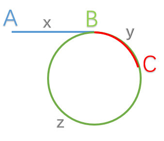

# 142. 环形链表 II

### 描述：
给定一个链表，返回链表开始入环的第一个节点。 如果链表无环，则返回 null。

说明：不允许修改给定的链表。

进阶：
你是否可以不用额外空间解决此题？
### 解答：

慢指针一次走一步，快指针依次走两步，假设第一次在C点相遇，此时slow走：x+y，fast走x+y+z+y。因为x+y+z+y = 2(x+y)。所以x = z。所以在第一次相遇点时，slow回到head，然后两指针同时以相同速度前进，相遇点便是B。
```java
/**
 * Definition for singly-linked list.
 * class ListNode {
 *     int val;
 *     ListNode next;
 *     ListNode(int x) {
 *         val = x;
 *         next = null;
 *     }
 * }
 */
public class Solution {
     public ListNode detectCycle(ListNode head) {
        if (head == null || head.next == null || head.next.next == null) {
            return null;
        }
        ListNode slow = head;
        ListNode fast = head;
        slow = slow.next;
        fast = fast.next.next;

        while (fast != slow) {
            fast = fast.next;
            if (fast == null) {
                return null;
            }
            fast = fast.next;
            if (fast == null) {
                return null;
            }
            slow = slow.next;
        }
        slow = head;
        while (fast != slow) {
            fast = fast.next;
            slow = slow.next;
        }
        return slow;
    }
}
```