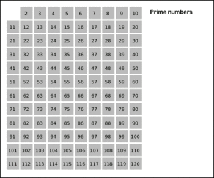

# 204. 计数质数

### 描述：
统计所有小于非负整数 n 的质数的数量。
### 示例：
```
输入: 10
输出: 4
解释: 小于 10 的质数一共有 4 个, 它们是 2, 3, 5, 7 。
```
### 解答：
埃拉托斯特尼筛法,见图：

```java
class Solution {
    public int countPrimes(int n) {
        boolean[] prime = new boolean[n];
        Arrays.fill(prime, true);
        for (int i = 2; i < n; i++) {
            if (prime[i]) {
                for (int j = i * 2; j < n; j += i) {
                    prime[j] = false;
                }
            }
        }
        int cnt = 0;
        for (int i = 2; i < n; i++) {
            if (prime[i] == true) {
                cnt++;
            }
        }
        return cnt;
    }
}
```